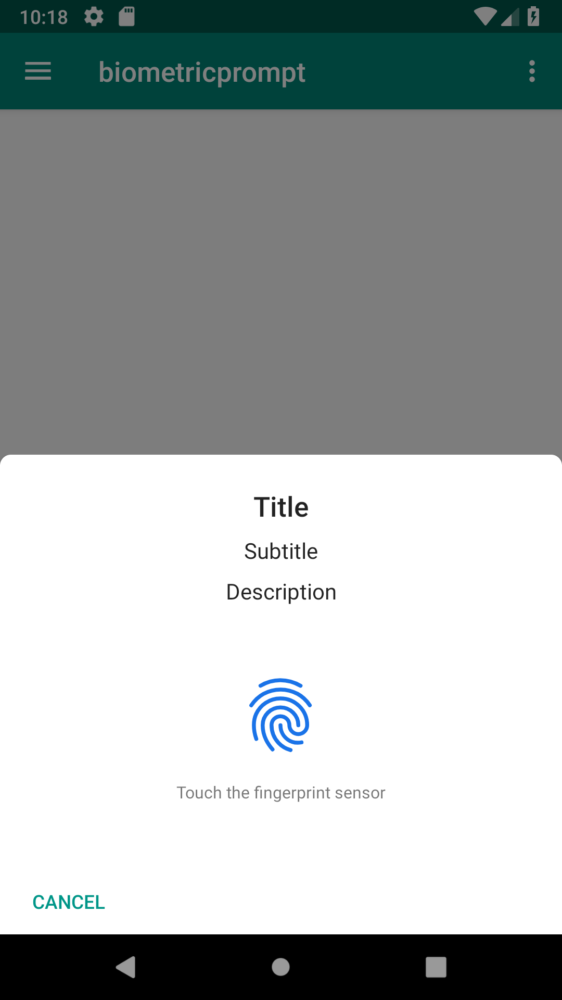

# Android Biometric Prompt Sample
A sample app for demonstrating biometric prompt provided from Android P (API 28)

Introduction
------------
This sample demonstrates how you can use system provided biometric authentication.

FingerprintManager is now deprecated and the apps need to implement the BiometricPrompt instead.

This sample app implements challenge-response fashion of authentication for the online user authentication like FIDO.

You can refer following reference documents for getting more detailed information [1].

[1]: https://developer.android.com/reference/android/hardware/biometrics/package-summary

Pre-requisites and limitation
-----------------------------
- Use Android Studio 3.2 to build this app (Android P)
- Lack of method for checking biometric enrollment (issue reported)
- Lack of method for checking face and iris feature on the device

Screenshots
-----------
